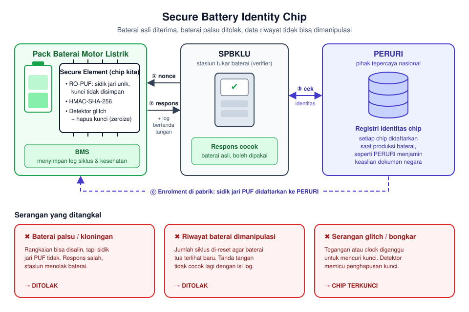

# Secure Battery Identity Chip — PERURI Chip Hackathon 2026

Chip *secure element* untuk autentikasi baterai kendaraan listrik di ekosistem tukar baterai (SPBKLU). Chip ini membuktikan bahwa sebuah baterai asli, menolak baterai palsu atau hasil kloning, dan menandatangani riwayat siklus/kesehatan baterai sehingga tidak bisa dimanipulasi.

**Topik lomba:** 1. Secure Identity & Security Element Chip



## Ide singkat

- **Kunci unik per chip dari RO-PUF.** Kunci tidak pernah disimpan di memori, jadi chip tidak bisa dikloning.
- **Challenge-response HMAC-SHA-256** (baseline TT07 SHA-256) dengan nonce dari stasiun sebagai anti-replay.
- **Penandatanganan data riwayat baterai.** Chip hanya menandatangani; log disimpan oleh BMS, sehingga tidak butuh memori non-volatil.
- **Detektor glitch/fault.** Kalau ada serangan, chip menghapus kunci (*zeroize*) dan mengunci diri.
- **PERURI sebagai pihak tepercaya** yang mendaftarkan identitas setiap chip saat produksi.
- **Penerapan kedua:** segel autentikasi untuk barang kena cukai bernilai tinggi, memakai chip yang sama.

## Jadwal

| Tanggal | Kegiatan |
|---|---|
| 8 Okt 2026 | Batas registrasi & pengumpulan proposal |
| 13 Okt 2026 | Pengumuman Top 5 |
| 18–20 Okt 2026 | Bootcamp Top 5 (3 hari) |
| 21–22 Okt 2026 | Summit, presentasi final & award |

## Struktur folder

```
proposal/      Draf dan versi final proposal (5 bagian sesuai panduan)
rtl/           Kode Verilog/SystemVerilog chip
sim/           Testbench cocotb + Verilator
model/         Model referensi Python (golden model)
fpga/          Proyek Quartus untuk Cyclone V (DE10-Nano)
docs/
  panduan/     Buku panduan & poster resmi lomba
  referensi/
    teknis/            Datasheet Tiny Tapeout 7 (baseline SHA-256, RO-PUF, dll.)
    regulasi-energi/   Perpres KBLBB, RUKN, RUPTL PLN, ringkasan IBC
  arsip/       Bahan lama yang tidak dipakai lagi (proposal CORDIC)
```

## Tools

Quartus Prime, Yosys, Verilator, cocotb, Python. Opsional: OpenROAD + SkyWater 130 PDK.

## Tim

| Nama | Peran |
|---|---|
| _(isi)_ | Ketua |
| _(isi)_ | Anggota |
| _(isi)_ | Anggota |
| _(isi)_ | Anggota |
| _(isi)_ | Dosen pembimbing |
